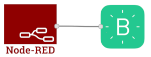
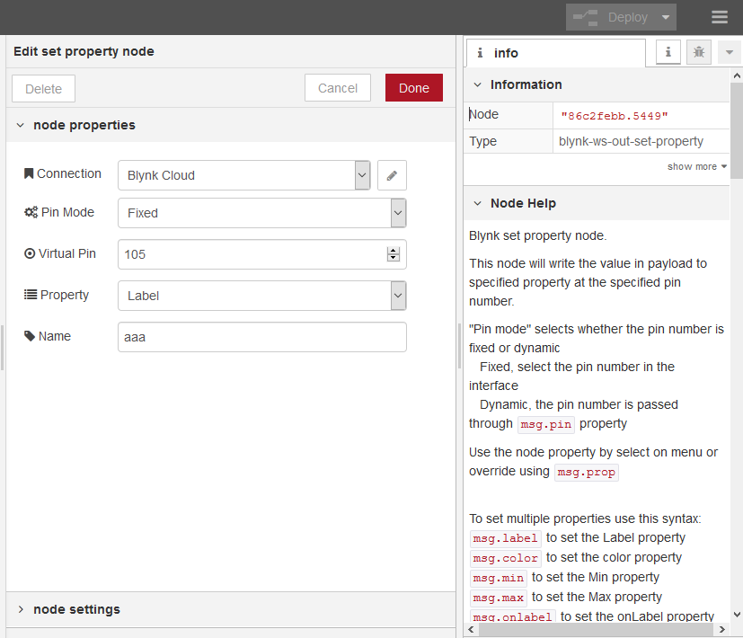

# node-red-contrib-blynk-ws
\
Blynk library implementation for [Node-RED](https://nodered.org/) using WebSockets

[](https://www.npmjs.com/package/node-red-contrib-blynk-ws)
[](https://www.npmjs.com/package/node-red-contrib-blynk-ws)
[](https://github.com/gablau/node-red-contrib-blynk-ws/stargazers)
[](https://github.com/gablau/node-red-contrib-blynk-ws/issues)
[](https://github.com/gablau/node-red-contrib-blynk-ws/blob/master/LICENSE)

[](https://www.npmjs.com/package/node-red-contrib-blynk-ws)

__________

## Node-RED blynk Websockets version
This library supports both SSL (wss://) and non secure (ws://) connection to local server and Blynk cloud server.
For local server, wss:// works only if you ve got a certificate installed.
For Blynk cloud server, you can use **ws://blynk-cloud.com/websockets** or with SSL **wss://blynk-cloud.com/websockets** as the server url.

If you installed Node Red globally use this command to install
```npm install --global node-red-contrib-blynk-ws```

### Supported events, commands and widgets


**Events:** read, write, app (connected/disconected)\
**Commands:** write, bridge, sync (virtual/all), set property\
**Widgets:** emails, notify, LCD, table, zeRGBa, styled button, image gallery

### Changelog

See the [changelog](CHANGELOG.md) for all the details of each releases

### Node-RED palette


### Blynk App Settings

Use Raspberry PI as hardware to access 128 virtual pins or Generic Board for 32.

### How to use

See information panel on every nodes



### Debug

Use the verbose `-v` flag when starting Node-RED to get more information
or use `node-red-log` and enable log on Configuration Node as needed


### Compatibility

This library is retrocompatible and can replace **node-red-contrib-blynk-websockets**.
To do this:
- stop node-red 
- install node-red-contrib-blynk-ws `npm install node-red-contrib-blynk-ws`
- remove node-red-contrib-blynk-websockets `npm uninstall node-red-contrib-blynk-websockets`
- edit your flow file `eg: "my-flows.js"` search for _'blynk-websockets-'_ and replace with _'blynk-ws-'_
- start node-red.

__________


## What is Blynk?
Blynk provides **iOS** and **Android** apps to control any hardware **over the Internet** or **directly using Bluetooth**.
You can easily build graphic interfaces for all your projects by simply dragging and dropping widgets, **right on your smartphone**.
Blynk is **the most popular IoT platform** used by design studios, makers, educators, and equipment vendors all over the world.

## Download

**Blynk [Arduino Library](https://github.com/blynkkk/blynk-library/releases/latest)**

**Blynk App: 
[ Google Play](https://play.google.com/store/apps/details?id=cc.blynk) | 
[ App Store](https://itunes.apple.com/us/app/blynk-control-arduino-raspberry/id808760481?ls=1&mt=8)**

**Blynk [Server](https://github.com/blynkkk/blynk-server)**

## Documentation
Social: [Webpage](http://www.blynk.cc) / [Facebook](http://www.fb.com/blynkapp) / [Twitter](http://twitter.com/blynk_app) / [Kickstarter](https://www.kickstarter.com/projects/167134865/blynk-build-an-app-for-your-arduino-project-in-5-m/description)  
Help Center: http://help.blynk.cc  
Documentation: http://docs.blynk.cc/#blynk-firmware  
Community Forum: http://community.blynk.cc  
Examples Browser: http://examples.blynk.cc  
Blynk for Business: http://www.blynk.io

## Quickstart: Arduino + Ethernet shield

* Download the Blynk app ([App Store](https://itunes.apple.com/us/app/blynk-control-arduino-raspberry/id808760481?ls=1&mt=8), [Google Play](https://play.google.com/store/apps/details?id=cc.blynk))
* Get the Auth Token from the app
* Import this library to Arduino IDE. Guide [here](http://arduino.cc/en/guide/libraries)
* In Arduino IDE, select File -> Examples -> Blynk -> Boards_Ethernet -> Arduino_Ethernet
* Update Auth Token in the sketch and upload it to Arduino
* Connect your Arduino with Ethernet shield to the internet

Please find examples on how to use different types of connections (transports) and how to do make something great with Blynk.
You can easily apply any type of board/connection to all examples.

__________

## Implementations for other platforms
* [C++, Arduino](https://github.com/blynkkk/blynk-library)
* [Particle](https://github.com/vshymanskyy/blynk-library-spark)
* [Node.js, Espruino, Browsers](https://github.com/vshymanskyy/blynk-library-js)
* [Lua, OpenWrt, NodeMCU](https://github.com/vshymanskyy/blynk-library-lua)
* [Python, MicroPython](https://github.com/vshymanskyy/blynk-library-python)
* [OpenWrt packages](https://github.com/vshymanskyy/blynk-library-openwrt)
* [MBED](https://developer.mbed.org/users/vshymanskyy/code/Blynk/)
* [LabVIEW](https://github.com/juncaofish/NI-LabVIEWInterfaceforBlynk)
* [C#](https://github.com/sverrefroy/BlynkLibrary)

## Attributions

The **node-red-contrib-blynk-ws** was born as a fork of **node-red-contrib-blynk-websockets**
     [https://github.com/tzapu/node-red-contrib-blynk-websockets](https://github.com/tzapu/node-red-contrib-blynk-websockets)  
Some javascripts code was derived from **blynk-library-js**:   
     [https://github.com/vshymanskyy/blynk-library-js](https://github.com/vshymanskyy/blynk-library-js) 

## License
This project is released under The MIT License (MIT)
